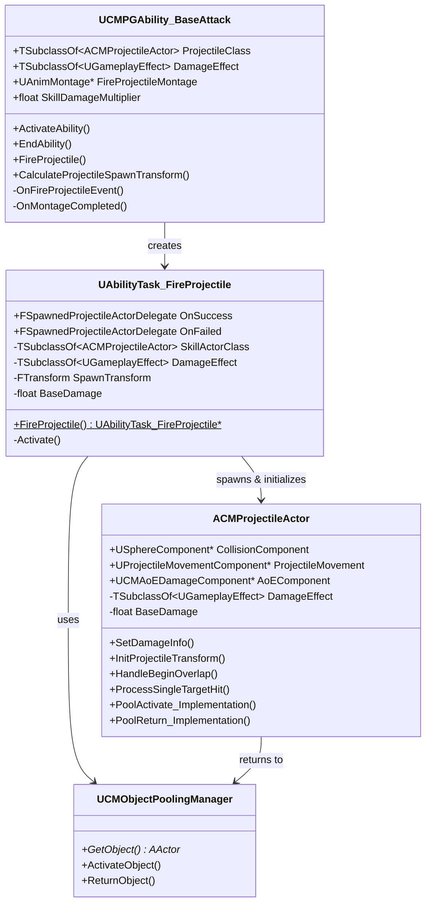
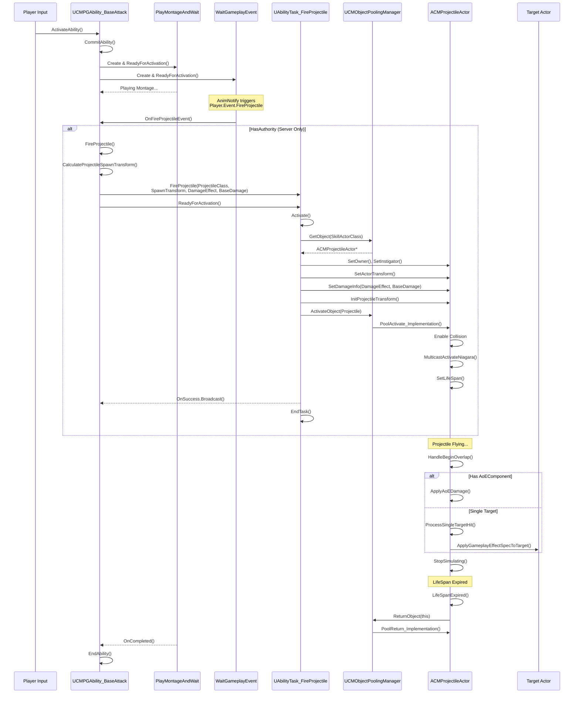

# BaseAttack Ability - FireProjectile Task - ProjectileActor 관계도

## 개요

이 문서는 Arcanist 캐릭터의 기본 공격 시스템을 구성하는 세 가지 핵심 클래스 간의 유기적인 관계를 설명합니다.

---

## 클래스 관계도 (Class Diagram)

---

## 실행 흐름도 (Sequence Diagram)

---

## 핵심 관계 요약

| 구성 요소 | 역할 | 주요 책임 |
|-----------|------|-----------|
| **UCMPGAbility_BaseAttack** | 컨트롤러 | 입력 처리, 몽타주 재생, Task 생성 및 조율 |
| **UAbilityTask_FireProjectile** | 팩토리 | 오브젝트 풀에서 Projectile 획득, 초기화, 활성화 |
| **ACMProjectileActor** | 실행자 | 이동, 충돌 감지, 데미지 적용, 풀 반환 |

---

## 상세 설명

### 1. UCMPGAbility_BaseAttack (BaseAttack Ability)

**파일 위치:** `Source/CrimsonMoon/Public/GameplayAbilitySystem/Abilities/Player/Arcanist/CMPGAbility_BaseAttack.h`

플레이어의 기본 공격 입력을 처리하는 GameplayAbility입니다.

**주요 흐름:**
1. `ActivateAbility()` - 어빌리티 활성화 시 호출
2. `CommitAbility()` - 리소스(스태미나 등) 소모 확인
3. `PlayMontageAndWait` Task 생성 - 공격 애니메이션 재생
4. `WaitGameplayEvent` Task 생성 - `Player.Event.FireProjectile` 태그 대기
5. AnimNotify에서 이벤트 발생 시 `OnFireProjectileEvent()` 호출
6. 서버에서만 `FireProjectile()` 실행

**핵심 프로퍼티:**
- `ProjectileClass` - 스폰할 투사체 클래스
- `DamageEffect` - 적용할 데미지 GameplayEffect
- `SkillDamageMultiplier` - 스킬 데미지 배율

---

### 2. UAbilityTask_FireProjectile (FireProjectile AbilityTask)

**파일 위치:** `Source/CrimsonMoon/Public/GameplayAbilitySystem/Task/AbilityTask_FireProjectile.h`

투사체를 스폰하고 초기화하는 AbilityTask입니다.

**주요 흐름:**
1. `FireProjectile()` (static) - Task 인스턴스 생성
2. `Activate()` - Task 활성화 시 호출
3. `ObjectPoolingManager`에서 투사체 획득
4. 투사체 초기화 (Owner, Instigator, Transform, DamageInfo)
5. 투사체 활성화
6. `OnSuccess` 또는 `OnFailed` 델리게이트 브로드캐스트

**오브젝트 풀링 사용:**
- 매번 새로운 액터를 스폰하는 대신 풀에서 재사용
- 성능 최적화 및 GC 부담 감소

---

### 3. ACMProjectileActor (ProjectileActor)

**파일 위치:** `Source/CrimsonMoon/Public/GameplayAbilitySystem/Abilities/Skill/Projectile/CMProjectileActor.h`

실제로 월드에서 날아가며 충돌을 처리하는 투사체 액터입니다.

**주요 컴포넌트:**
- `USphereComponent` - 충돌 감지
- `UProjectileMovementComponent` - 투사체 이동
- `UCMAoEDamageComponent` (옵션) - 범위 데미지

**생명주기:**
1. `PoolActivate_Implementation()` - 풀에서 활성화
2. `InitProjectileTransform()` - 이동 시작
3. `HandleBeginOverlap()` - 충돌 감지 및 데미지 처리
4. `LifeSpanExpired()` - 수명 종료 시 풀 반환
5. `PoolReturn_Implementation()` - 풀로 반환 및 상태 초기화

**리플리케이션:**
- `bReplicates = true` - 서버에서 클라이언트로 복제
- `MulticastActivateNiagara()` / `MulticastDeactivateNiagara()` - 이펙트 동기화

---

## 관련 파일

- `Source/CrimsonMoon/Private/GameplayAbilitySystem/Abilities/Player/Arcanist/CMPGAbility_BaseAttack.cpp`
- `Source/CrimsonMoon/Private/GameplayAbilitySystem/Task/AbilityTask_FireProjectile.cpp`
- `Source/CrimsonMoon/Private/GameplayAbilitySystem/Abilities/Skill/Projectile/CMProjectileActor.cpp`
- `Source/CrimsonMoon/Public/System/CMObjectPoolingManager.h`
